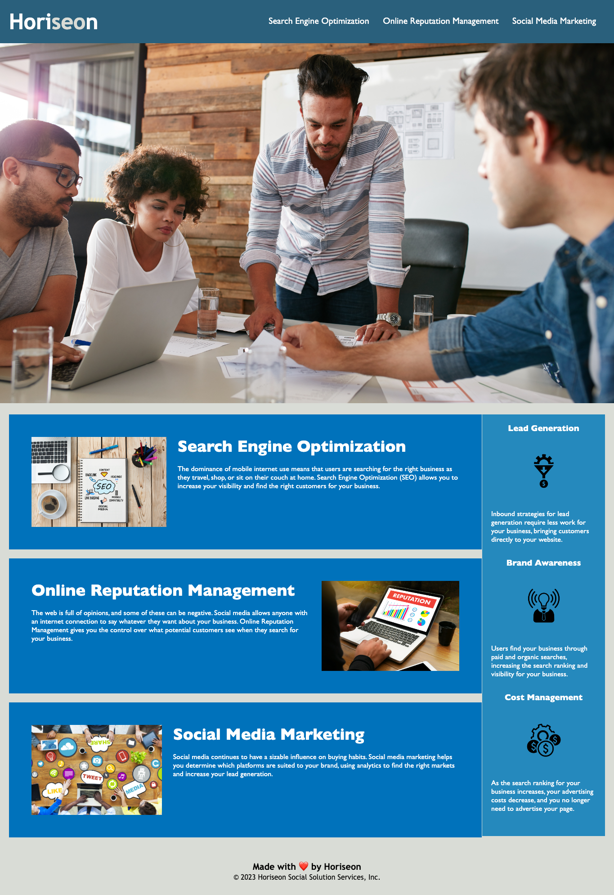

# Description
This is a website designed to encompass the benefits of using Horisean Social Solution Services, Inc.

This project includes refactored html semantics and CSS code to meet the acceptance criteria listed below:

GIVEN a webpage meets accessibility standards
WHEN I view the source code
THEN I find semantic HTML elements
WHEN I view the structure of the HTML elements
THEN I find that the elements follow a logical structure independent of styling and positioning
WHEN I view the image elements
THEN I find accessible alt attributes
WHEN I view the heading attributes
THEN they fall in sequential order
WHEN I view the title element
THEN I find a concise, descriptive title

The following image shows what the deployed application looks like:

